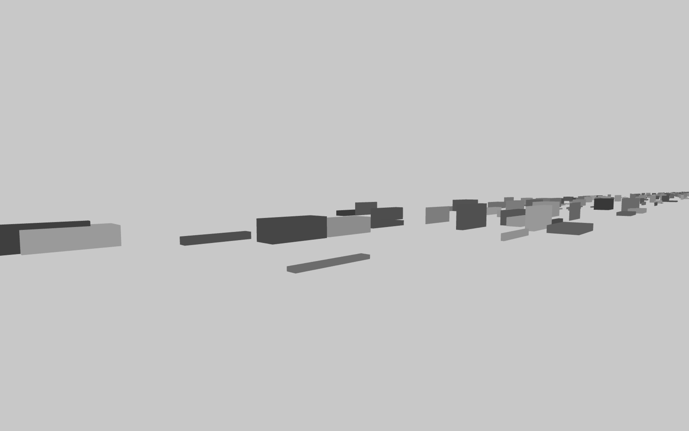
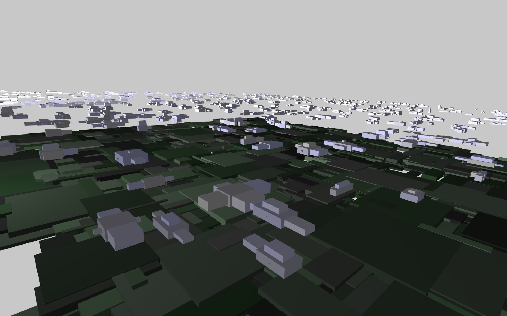
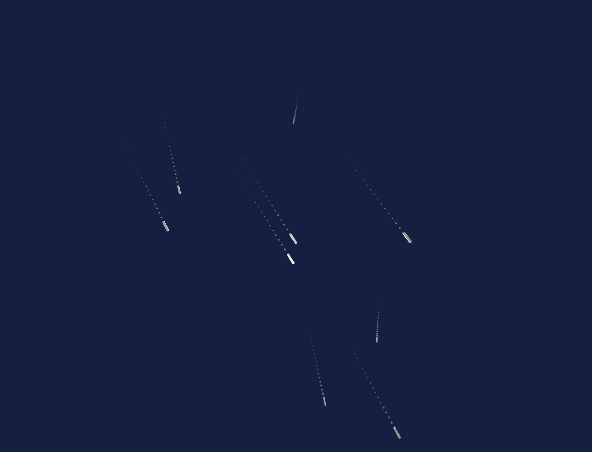

# drawNetherlands
©2019 daniel buzzo. dan@buzzo.com  http://buzzo.com

generative sketches inspired by landscape observations

* Trucks - working
* train windows
* Clouds over Oxfordshire - working
* from the air
* Tankers lying at anchor off the Zaandvoort coast - working

### dependencies
* C++ and openFrameworks - openframeworks.cc
* ofxCameraSaveLoad https://github.com/roymacdonald/ofxCameraSaveLoad

### key controls
* 'f' toggle full screen
* 'g' show text gui
* 'l' load saved camera position
* 's' save new camera position
* 'h' zero centre camera postion

* repositories (mostly) include compiled executable binaries for OSX

