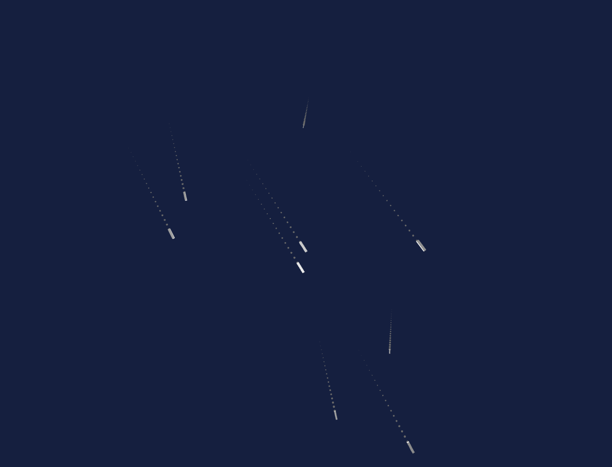

# Draw test for landscape observations

## tankers at sea off the Zaandvoort coast

as seen from KLM embrayer BRS-AMS

### dependencies

ofxCameraSaveLoad https://github.com/roymacdonald/ofxCameraSaveLoad

* 'f' toggle full screen
* 'g' show text gui
* 'l' load saved camera position
* 's' save new camera position
* 'h' zero centre camera postion

