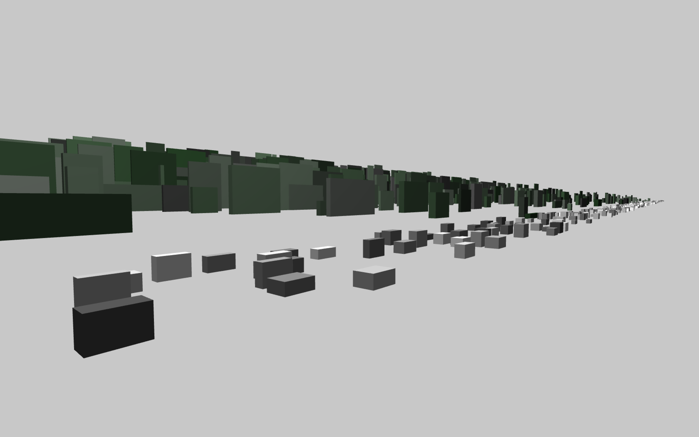

# Draw test for landscape observations

## trucks on the highway

as seen from the train, Schiphol to Amsterdam Central

### dependencies

ofxCameraSaveLoad https://github.com/roymacdonald/ofxCameraSaveLoad

* 'f' toggle full screen
* 'g' show text gui
* 'l' load saved camera position
* 's' save new camera position
* 'h' zero centre camera postion

video on vimeo https://vimeo.com/338398783
